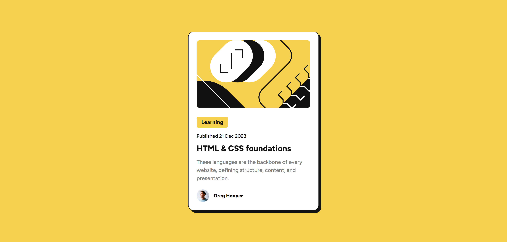

# Frontend Mentor - Blog preview card solution

This is a solution to the [Blog preview card challenge on Frontend Mentor](https://www.frontendmentor.io/challenges/blog-preview-card-ckPaj01IcS). Frontend Mentor challenges help you improve your coding skills by building realistic projects.

## Table of contents

- [Frontend Mentor - Blog preview card solution](#frontend-mentor---blog-preview-card-solution)
  - [Table of contents](#table-of-contents)
  - [Overview](#overview)
    - [The challenge](#the-challenge)
    - [Screenshot](#screenshot)
    - [Links](#links)
  - [My process](#my-process)
    - [Built with](#built-with)
  - [Author](#author)

## Overview

### The challenge

Users should be able to:

- See hover and focus states for all interactive elements on the page

### Screenshot

### Links

- Solution URL: [https://github.com/ShrutiShinde418/FrontendMentor6/tree/main/blog-preview-card](https://github.com/ShrutiShinde418/FrontendMentor6/tree/main/blog-preview-card)
- Live Site URL: [https://blog-preview-card-pied.vercel.app/](https://blog-preview-card-pied.vercel.app/)

## My process

### Built with

- Semantic HTML5 markup
- Vanilla CSS

## Author

- Website - [Portfolio](https://portfolio-devchallenges-henna.vercel.app/)
- Frontend Mentor - [@ShrutiShinde418](https://www.frontendmentor.io/profile/ShrutiShinde418)
