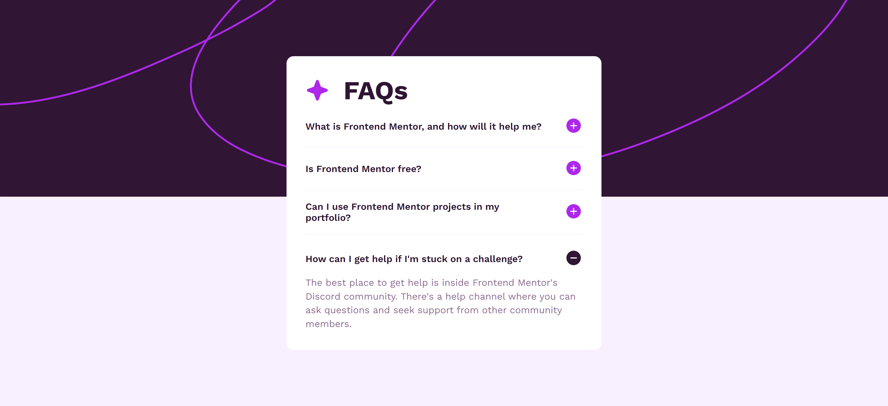

# Frontend Mentor - FAQ accordion solution

This is a solution to the [FAQ accordion challenge on Frontend Mentor](https://www.frontendmentor.io/challenges/faq-accordion-wyfFdeBwBz). Frontend Mentor challenges help you improve your coding skills by building realistic projects.

## Table of contents

- [Frontend Mentor - FAQ accordion solution](#frontend-mentor---faq-accordion-solution)
  - [Table of contents](#table-of-contents)
  - [Overview](#overview)
    - [The challenge](#the-challenge)
    - [Screenshot](#screenshot)
    - [Links](#links)
  - [My process](#my-process)
    - [Built with](#built-with)
    - [What I learned](#what-i-learned)
    - [Useful resources](#useful-resources)
  - [Author](#author)

## Overview

### The challenge

Users should be able to:

- Hide/Show the answer to a question when the question is clicked
- Navigate the questions and hide/show answers using keyboard navigation alone
- View the optimal layout for the interface depending on their device's screen size
- See hover and focus states for all interactive elements on the page

### Screenshot

### Links

- Solution URL: [https://github.com/ShrutiShinde418/FrontendMentor6/tree/main/faq-accordion-main](https://github.com/ShrutiShinde418/FrontendMentor6/tree/main/faq-accordion-main)
- Live Site URL: [https://faq-accordion-amber-ten.vercel.app/](https://faq-accordion-amber-ten.vercel.app/)

## My process

### Built with

- Semantic HTML5 markup
- LESS CSS
- Flexbox
- CSS Grid

### What I learned

- Making an accordion using JS
- Making only one accordion element visible at a time

### Useful resources

- [15 Projects using Vanilla JS](https://www.youtube.com/watch?v=3PHXvlpOkf4&pp=ygUbZnJlZWNvZGVjYW1wIDE1IGpzIHByb2plY3Rz)

## Author

- Website - [Portfolio](https://portfolio-devchallenges-henna.vercel.app/)
- Frontend Mentor - [@ShrutiShinde418](https://www.frontendmentor.io/profile/ShrutiShinde418)
